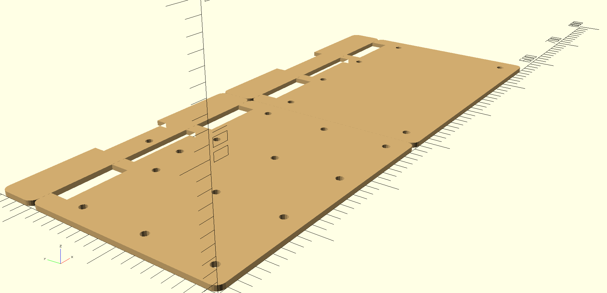

# Easel
CAD model for a James Gurney-style Sketch Easel built with OpenSCAD.

## Features
- Alleviates crippling knee pain from painting on the floor for a few hours. (I'm old.)
- Suitable for exporting as DXF for laser cutting Easel parts.
- Magnetically attached palate, brush holder and sketchbook holder.

## Additional Materials
- 5mm A2 sized Plywood board
- M6 T-nut
- 18x 8mm Neodyium Magnets
- 2x Torque hinges
